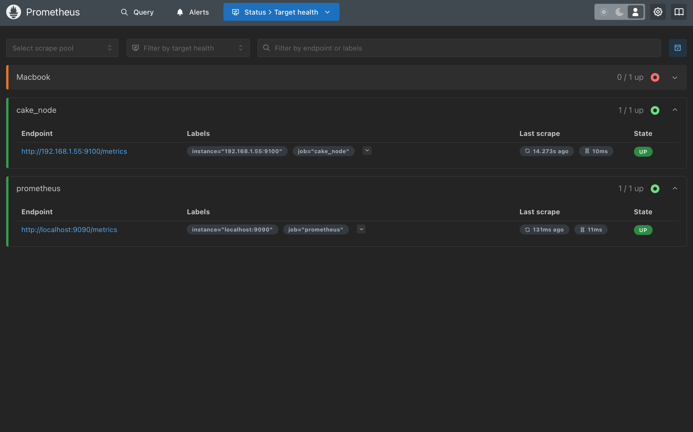

# Prometheus

**1. Prometheus：主要用于监控与报警**

- **功能**：Prometheus 是一个开源的时间序列数据监控系统，专门用于收集和存储系统的性能指标数据，并提供强大的查询语言（PromQL）进行数据分析。它非常适合于容器化环境和微服务架构。**
- **用途**：用于监控和报警，尤其是在云原生环境（如 Kubernetes）中，监控应用程序、容器、虚拟机等的性能数据。

- **数据存储**：Prometheus 使用时间序列数据存储，每个数据点都有时间戳，记录性能指标（如 CPU 使用率、内存消耗等）。

- **监控方式**：Prometheus 通过 **拉取模型** 定期从被监控目标（如服务器、应用、容器）获取数据，支持通过多种 Exporter 模块来收集数据。

- **报警功能**：通过 **Alertmanager** 来配置报警规则，并在达到阈值时发送通知。

**适用场景**：适合实时监控、容器和微服务监控、时序数据分析，特别是在云环境和分布式系统中。

Prometheus 的基本架构


## 安装

**Docker**

```shell
# 在主机上创建目录
mkdir -p /path/to/prometheus
# 创建 prometheus.yml 配置文件
nano /path/to/prometheus/prometheus.yml
# 配置yml

global:
  scrape_interval: 15s  # 抓取间隔时间

scrape_configs:
  - job_name: "prometheus"
    static_configs:
      - targets: ["localhost:9090"]  # 监控 Prometheus 自身

# docker中运行
docker run -d \
  --name prometheus \
  -p 9090:9090 \
  -v /path/to/prometheus/prometheus.yml:/etc/prometheus/prometheus.yml \
  prom/prometheus
```

**Mac**

```shell
brew install Prometheus
# 安装 node_exporter 以便 prometheus 抓取信息
brew install node_exporter
# 配置 prometheus.yml 运行
mkdir -p ~/prometheus
nano ~/prometheus/prometheus.yml
# 配置 yml 文件为如下
global:
  scrape_interval: 15s  # 默认抓取时间间隔

scrape_configs:
  - job_name: "prometheus"
    static_configs:
      - targets: ["localhost:9090"]  
# 保存并退出
prometheus --config.file=/Users/elpcoin/prometheus/prometheus.yml
# 在后台运行
brew services start prometheus
```

运行的 yml 文件默认路径
```shell
 /opt/homebrew/etc/prometheus.yml
```

## **配置 yml** 

配置前可以访问 node exporter 的 http://localhost:9100/metrics 查看是否启动
```
scrape_configs:
  - job_name: 'prometheus'
    static_configs:
      - targets: ['localhost:9090']
  # 采集node exporter监控数据
  - job_name: 'node'
    static_configs:
      - targets: ['localhost:9100]
```



# Grafana

```shell
# 下载
brew install grafana
# 配置 ini文件
nano /opt/homebrew/etc/grafana/grafana.ini 
```

## init 文件配置 smtp 邮箱

```ini
[smtp]
enabled = true
host = smtp.126.com:465
user = [邮箱]
# If the password contains # or ; you have to wrap it with triple quotes. Ex """#password;"""
password = [smtp密钥]
;cert_file =
;key_file =
skip_verify = true
from_address = [邮箱]
from_name = Grafana
# EHLO identity in SMTP dialog (defaults to instance_name)
;ehlo_identity = dashboard.example.com
# SMTP startTLS policy (defaults to 'OpportunisticStartTLS')
;startTLS_policy = NoStartTLS
# Enable trace propagation in e-mail headers, using the 'traceparent', 'tracestate' and (optionally) 'baggage' fields (defaults to false)
enable_tracing = true
```

```shell
# 拉起 Grafana
brew services start grafana
```

## 登陆
默认登陆账号/密码  admin/admin

connections - prometheus - 填入相关配置URL 为安全也可以配置 Authentication

## 测试邮件服务
Alerting - contact points - Email - Test

## 导入社区 Dashboards

Dashboards - import


## 用户管理 与 权限管理


---

参考：

1. [Prometheus 中文文档](https://www.prometheus.wang)
1. [prometheus.io](https://prometheus.io/docs/introduction/overview/)
1. [Grafana 官网教程](https://grafana.com/docs/grafana/latest/?utm_source=grafana_gettingstarted)

